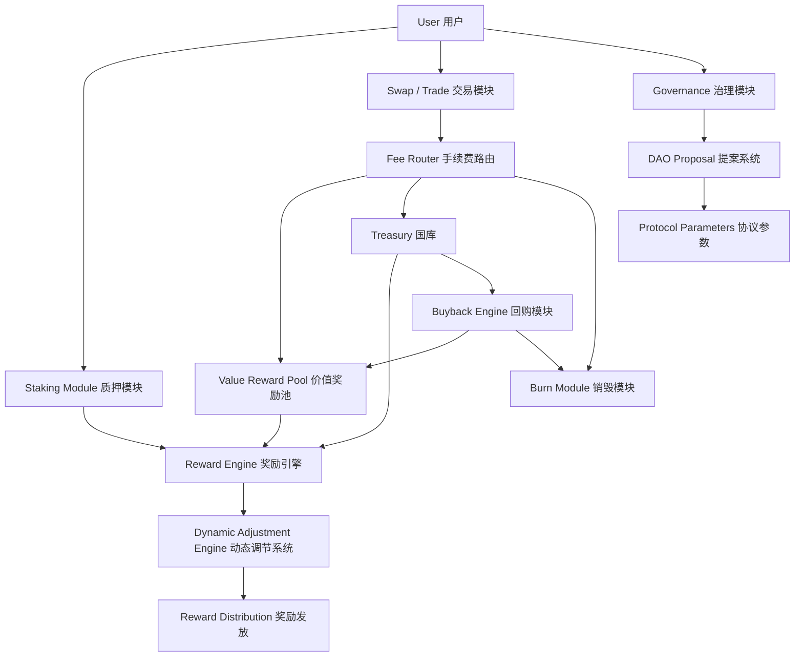
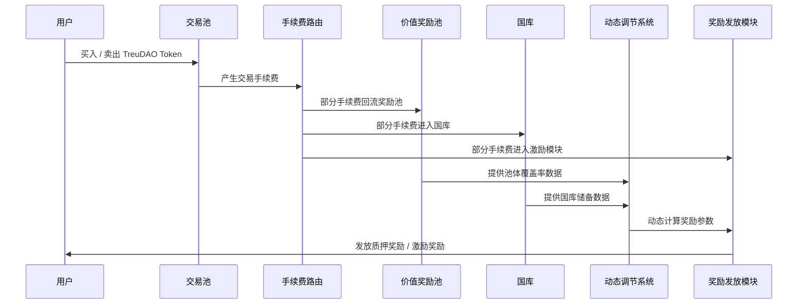
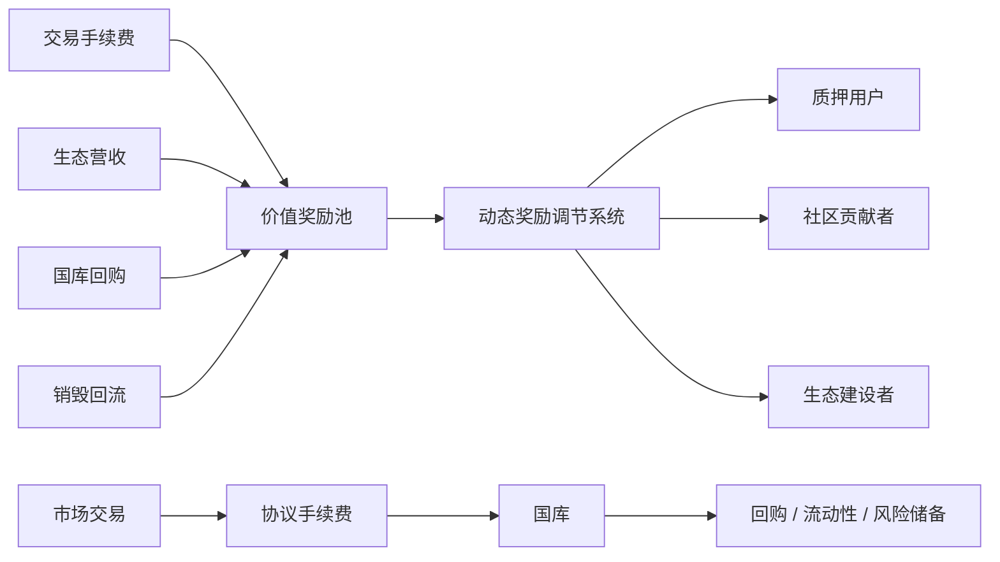

# TreuDAO

> Protocol-Driven Value Infrastructure for Sustainable DeFi
> 一个由协议驱动、社区治理、价值循环与生态共建组成的去中心化金融协议。

---

## 简介

**TreuDAO** 是一个面向 DeFi 3.0 时代的链上价值协议，致力于构建一个更加公平、透明、可持续的去中心化金融运行体系。

与传统高通胀激励、单一资金池分配或短周期收益模型不同，TreuDAO 通过 **动态托底机制、价值奖励池、协议回流、国库调节、供给管理与社区治理**，形成一套可持续运行的链上价值循环系统。

TreuDAO 的目标不是简单制造短期收益，而是通过协议规则将用户、社区、生态项目、流动性与国库连接起来，让代币价值能够在持续交易、生态营收、市场回流与治理共识中不断沉淀。

---

## 核心价值主张

TreuDAO 的核心价值主张可以概括为：

### 1. 协议驱动，而非人为干预

TreuDAO 的关键规则由智能合约执行，包括质押、奖励发放、池体覆盖率计算、国库调节、回购触发、奖励调节等，最大程度减少人为干预空间。

### 2. 价值循环，而非单向消耗

协议通过交易手续费回流、生态营收注入、旋流池回补、国库回购、销毁回流等方式，将市场行为转化为协议价值来源，形成多路径价值循环。

### 3. 动态调节，而非固定高收益

TreuDAO 不依赖长期固定高收益承诺，而是根据协议池体状态、全网质押率、市场流动性、覆盖率等指标动态调节奖励强度，使系统能够在不同市场周期中保持弹性。

### 4. 社区共建，而非中心化控制

TreuDAO 鼓励社区参与治理、生态建设、节点传播、协议提案与公共资源建设，让协议发展由社区共识共同推动。

### 5. 长期可持续，而非短期爆发

TreuDAO 的设计重点不是短期价格波动，而是通过协议储备、价值支撑、动态托底与供给管理，构建长期运行能力。

---

## 🧱 技术架构

TreuDAO 采用模块化智能合约架构，由多个核心协议模块共同组成。



### 架构组成

| 模块                        | 说明                       |
| ------------------------- | ------------------------ |
| Staking Module            | 用户质押入口，支持单币质押、周期质押与权重计算  |
| Reward Engine             | 根据协议规则计算用户奖励             |
| Value Reward Pool         | 协议价值奖励池，用于承接交易回流与生态收入    |
| Treasury                  | 协议国库，用于储备、回购、风险缓冲与生态建设   |
| Dynamic Adjustment Engine | 根据实时指标动态调整奖励、回购、补给与释放节奏  |
| Fee Router                | 手续费路由系统，将交易手续费分配至不同协议模块  |
| Burn Module               | 代币销毁模块，用于减少流通压力          |
| Buyback Engine            | 当系统触发特定条件时执行回购与价值补充      |
| Governance Module         | DAO 治理模块，支持社区提案与投票       |
| Oracle / Data Layer       | 用于读取价格、池体状态、质押率、覆盖率等关键数据 |

---

## 🔄 标准交易流程

TreuDAO 的标准交易流程围绕用户交易、手续费回流、价值奖励池补给、动态调节与奖励发放展开。



### 交易流程说明

1. 用户在链上完成买入、卖出或流动性操作。
2. 协议从交易行为中收取一定比例手续费。
3. 手续费通过 Fee Router 自动分流至价值奖励池、国库、销毁模块与生态激励模块。
4. 动态调节系统持续读取池体覆盖率、质押率、市场流动性与全网算力等数据。
5. 协议根据实时状态自动调节奖励释放、回购强度、销毁比例与补给策略。
6. 用户根据质押周期、质押权重、全网参与情况获得对应奖励。

---

## ⚖️ 核心创新

### 1. 动态托底价机制

TreuDAO 引入动态托底价理念，不以固定价格承诺作为支撑，而是根据协议储备、价值奖励池覆盖率、市场流动性、国库回购能力等因素形成动态价值支撑区间。

这使协议能够避免僵化托底带来的风险，同时在市场波动中保持更强的自适应能力。

### 2. 价值奖励池覆盖率模型

协议通过价值奖励池覆盖率判断系统健康状态。

当覆盖率较高时，协议可维持正常奖励释放；
当覆盖率下降时，系统将自动降低释放强度、启动回购、调整激励或触发补给机制。

### 3. 动态奖励调节系统

TreuDAO 不采用固定收益模型，而是通过多维指标动态计算奖励：

* 价值奖励池覆盖率
* 价值奖励池充足率
* 全网分周期质押率
* 全网质押总算力
* 国库储备状态
* 市场交易活跃度
* 生态营收回流规模

### 4. 多源价值补给机制

TreuDAO 的奖励来源不依赖单一入口，而是由多个价值来源共同组成：

* 交易手续费回流
* 旋流池代币回流
* 生态项目营收注入
* 国库回购补充
* 销毁代币部分回流
* 外部生态合作收益

### 5. 协议级供给管理

TreuDAO 通过恒定基础供给、回购销毁、流通调节、应急机制等方式管理代币供给，减少无序增发对长期价值造成的压力。

### 6. DAO 共治机制

协议核心参数、生态基金使用、重大模块升级、国库策略与社区提案均可纳入 DAO 治理范围，由社区共同参与决策。

---

## 🧩 核心模块

### 1. 质押模块 Staking Module

用户可将 TreuDAO Token 质押至协议合约，根据质押数量、质押周期与系统权重获得奖励。

核心功能：

* 单币质押
* 周期质押
* 权重计算
* 奖励累计
* 解押管理
* 复投支持

---

### 2. 价值奖励池 Value Reward Pool

价值奖励池是 TreuDAO 的核心价值承接模块，用于接收协议回流资金并支持用户奖励发放。

主要来源：

* 交易手续费
* 生态营收
* 国库补给
* 回购回流
* 销毁回流
* 合作项目收益

---

### 3. 动态调节模块 Dynamic Adjustment Engine

动态调节模块负责根据协议实时状态调整奖励与补给参数。

核心指标：

| 指标    | 作用         |
| ----- | ---------- |
| 覆盖率   | 判断奖励池安全程度  |
| 充足率   | 判断短期奖励发放能力 |
| 质押率   | 判断市场锁仓强度   |
| 总算力   | 判断全网参与权重   |
| 国库储备  | 判断协议风险缓冲能力 |
| 交易活跃度 | 判断市场流动性状态  |

---

### 4. 国库模块 Treasury

国库是协议的战略储备系统，用于生态建设、风险缓冲、市场调节与回购支持。

国库用途：

* 协议风险储备
* 市场回购
* 流动性支持
* 生态项目扶持
* 安全审计支出
* 社区激励
* DAO 治理预算

---

### 5. 回购与销毁模块 Buyback & Burn

当协议达到特定触发条件时，回购模块可从市场回购代币，并根据治理规则进行销毁、回流或储备。

作用：

* 降低市场流通压力
* 提升协议价值支撑
* 增强长期持有信心
* 优化供需关系

---

### 6. 治理模块 Governance

治理模块允许社区参与协议发展方向。

治理内容包括：

* 协议参数调整
* 奖励规则升级
* 国库使用提案
* 生态合作提案
* 合约升级提案
* 社区激励方案
* 安全策略优化

---

### 7. 安全模块 Security Layer

TreuDAO 将安全视为协议长期运行的基础。

安全设计包括：

* 多签管理
* 时间锁机制
* 权限隔离
* 合约审计
* 风险参数限制
* 异常交易监控
* 紧急暂停机制
* DAO 审核流程

---

## 💎 经济模型与激励机制

TreuDAO 的经济模型围绕 **价值流入、价值沉淀、价值调节、价值分配** 四个层面展开。



### 代币用途

TreuDAO Token 可用于：

* 质押获取协议奖励
* 参与 DAO 治理
* 发起社区提案
* 参与生态激励
* 支付部分协议费用
* 进入生态应用场景
* 获取长期价值权益

---

### 激励来源

协议激励主要来自：

1. 交易手续费回流
2. 价值奖励池释放
3. 国库回购补充
4. 生态项目营收
5. 合作协议分润
6. 销毁与回流机制
7. DAO 社区激励预算

---

### 奖励调节逻辑

TreuDAO 的奖励不是固定不变的，而是根据系统健康状态动态变化。

| 系统状态  | 协议行为    |
| ----- | ------- |
| 覆盖率充足 | 正常释放奖励  |
| 覆盖率下降 | 降低释放速度  |
| 国库充足  | 启动回购补给  |
| 市场过热  | 提高锁仓权重  |
| 流动性不足 | 加强流动性激励 |
| 风险升高  | 触发保护机制  |

---

### 供给管理

TreuDAO 采用更加稳健的供给管理思路：

* 初始供给固定
* 常规阶段不进行持续增发
* 奖励基于存量循环分配
* 回购销毁减少流通压力
* 特殊风险场景设置应急机制
* 所有关键供给规则由合约与 DAO 共同约束

---

## 📖 路线图

### Phase 1：协议设计与基础建设

* 完成 TreuDAO 协议模型设计
* 完成经济模型设计
* 完成核心模块拆分
* 完成白皮书初稿
* 完成 GitHub 仓库初始化
* 完成社区基础建设

---

### Phase 2：智能合约开发

* 开发 Token 合约
* 开发质押模块
* 开发奖励模块
* 开发价值奖励池模块
* 开发手续费路由模块
* 开发国库模块
* 开发回购与销毁模块
* 开发治理模块

---

### Phase 3：测试网部署

* 部署测试网合约
* 开放社区测试
* 进行多轮压力测试
* 修复合约漏洞
* 优化 Gas 成本
* 验证动态调节模型
* 发布测试网数据报告

---

### Phase 4：安全审计与治理启动

* 完成内部安全测试
* 接入第三方安全审计
* 发布审计报告
* 启动 DAO 治理测试
* 开放社区提案系统
* 完成主网部署准备

---

### Phase 5：主网启动

* 部署主网合约
* 启动初始流动性
* 开放质押功能
* 开放奖励领取
* 启动社区治理
* 上线数据看板
* 开放生态合作入口

---

### Phase 6：生态扩展

* 接入更多 DeFi 协议
* 建设生态应用层
* 推出 AI Treasury 模块
* 推出 AI Wallet 模块
* 推出生态预测市场
* 推出流动性网络
* 推动跨链部署
* 建设 TreuDAO 生态联盟

---

## 🤝 社区与贡献

TreuDAO 是一个开放、透明、社区驱动的协议，欢迎开发者、研究员、社区成员、设计师、安全审计人员与生态合作方共同参与。

### 你可以贡献什么？

* 智能合约开发
* 前端开发
* 协议研究
* 经济模型优化
* 安全审计
* 文档翻译
* 社区运营
* 品牌设计
* 数据分析
* 生态合作

---

### 贡献流程

1. Fork 本仓库
2. 创建你的功能分支

```bash
git checkout -b feature/your-feature-name
```

3. 提交你的修改

```bash
git commit -m "Add your feature"
```

4. 推送到远程分支

```bash
git push origin feature/your-feature-name
```

5. 提交 Pull Request

---

### 社区原则

TreuDAO 社区坚持：

* 开放协作
* 透明治理
* 长期主义
* 风险意识
* 技术优先
* 共识共建
* 价值共享

---

## 🚀 快速入门（开发者）

> 以下为开发者本地部署与测试示例，具体命令可根据实际技术栈调整。

### 环境要求

建议环境：

* Node.js >= 18
* npm >= 9
* Git
* Hardhat 或 Foundry
* MetaMask
* Solidity >= 0.8.x

---

### 克隆仓库

```bash
git clone https://github.com/treudao/treudao-protocol.git
cd treudao-protocol
```

---

### 安装依赖

```bash
npm install
```

---

### 配置环境变量

复制环境变量模板：

```bash
cp .env.example .env
```

编辑 `.env` 文件：

```env
PRIVATE_KEY=your_private_key
RPC_URL=your_rpc_url
ETHERSCAN_API_KEY=your_etherscan_api_key
```

---

### 编译合约

```bash
npx hardhat compile
```

---

### 运行测试

```bash
npx hardhat test
```

---

### 本地启动节点

```bash
npx hardhat node
```

---

### 部署到本地网络

```bash
npx hardhat run scripts/deploy.js --network localhost
```

---

### 部署到测试网

```bash
npx hardhat run scripts/deploy.js --network sepolia
```

---

### 推荐项目结构

```bash
treudao-protocol/
├── contracts/
│   ├── TreuToken.sol
│   ├── StakingModule.sol
│   ├── RewardEngine.sol
│   ├── ValueRewardPool.sol
│   ├── Treasury.sol
│   ├── FeeRouter.sol
│   ├── BuybackBurn.sol
│   └── Governance.sol
│
├── scripts/
│   └── deploy.js
│
├── test/
│   ├── staking.test.js
│   ├── reward.test.js
│   ├── treasury.test.js
│   └── governance.test.js
│
├── docs/
│   ├── architecture.md
│   ├── tokenomics.md
│   ├── governance.md
│   └── security.md
│
├── hardhat.config.js
├── package.json
├── .env.example
└── README.md
```

---

## 安全说明

TreuDAO 当前仍处于协议建设与开发阶段。所有合约在正式主网上线前，均应完成完整测试、安全审计与社区验证。

请注意：

* 本项目不构成任何投资建议
* 协议奖励不代表固定收益承诺
* DeFi 协议存在智能合约风险、市场风险与流动性风险
* 用户应充分理解风险后再参与任何链上操作

---

## License

本项目建议采用 MIT License。

```text
MIT License

Copyright (c) TreuDAO

Permission is hereby granted, free of charge, to any person obtaining a copy
of this software and associated documentation files...
```

---

## About TreuDAO

TreuDAO is not just a DeFi protocol.
It is a protocol-driven value infrastructure designed for long-term sustainability, community governance, and on-chain value circulation.

**Build together. Govern together. Grow together.**
