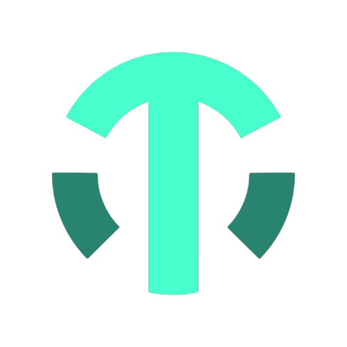
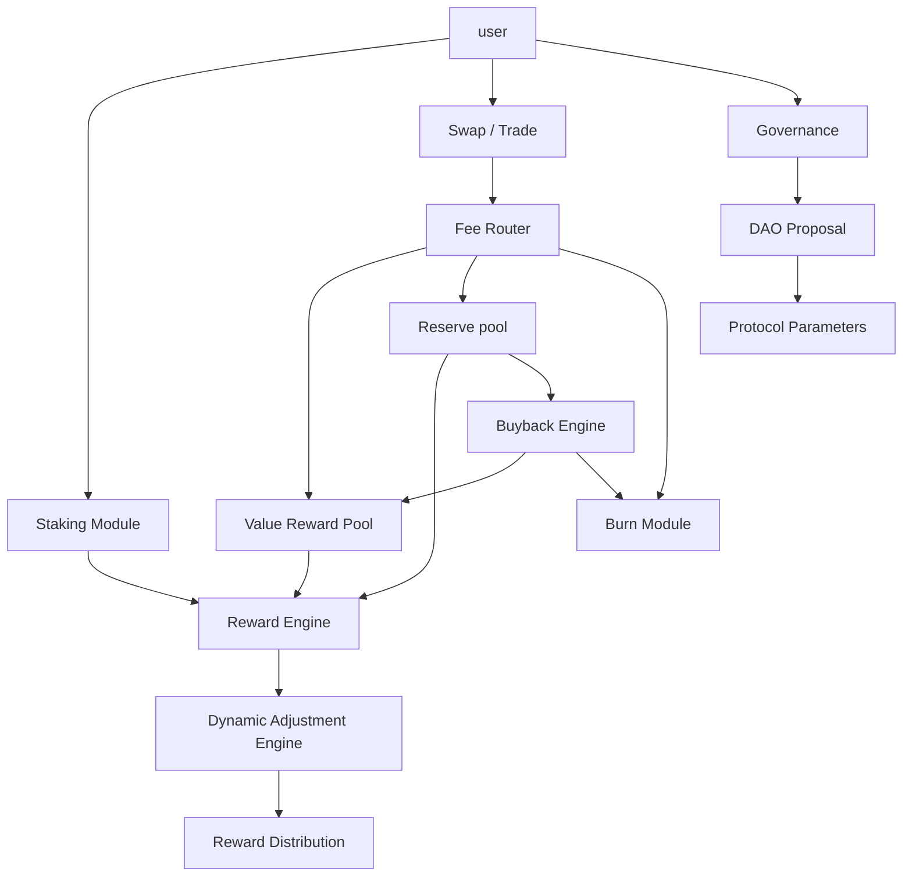
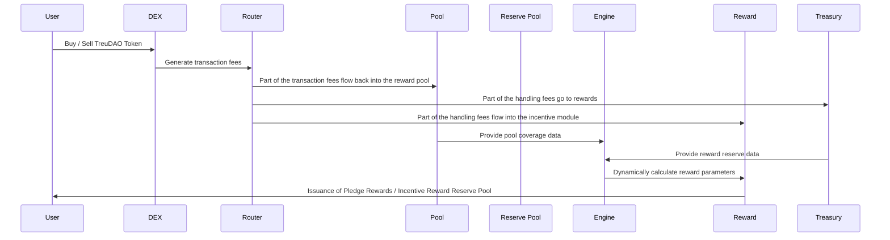
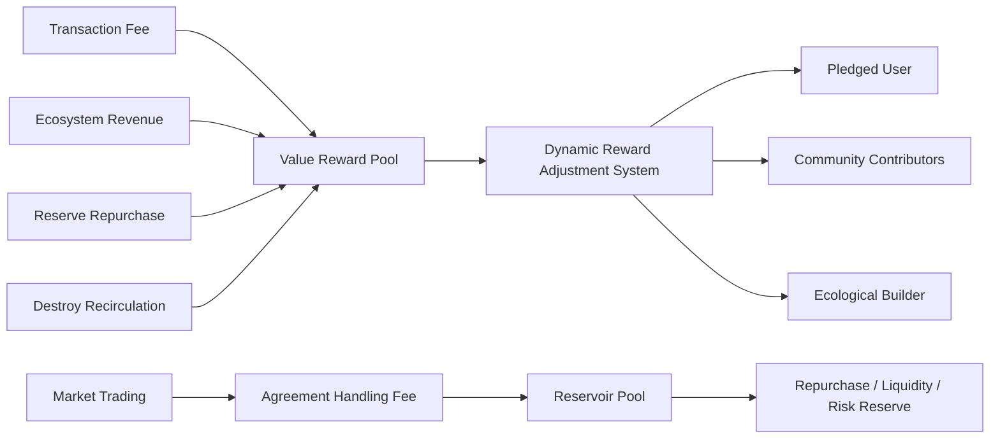

<p align="center">
  
</p>

<h1 align="center">TrueDAO</h1>

<p align="center">
  <strong>Protocol-Driven Value Infrastructure for Sustainable DeFi</strong>
</p>

<p align="center">
  A decentralized finance protocol driven by smart contracts, community governance, value circulation, reserve regulation, and ecosystem co-creation.
</p>

<p align="center">
  <em>Protocol Rules → Value Inflow → Dynamic Regulation → Sustainable Rewards</em>
</p>

<p align="center">
  <a href="#introduction">Introduction</a> ·
  <a href="#core-value-proposition">Value Proposition</a> ·
  <a href="#-technical-architecture">Architecture</a> ·
  <a href="#-core-innovation">Innovation</a> ·
  <a href="#-economic-models-and-incentive-mechanisms">Tokenomics</a> ·
  <a href="#-roadmap">Roadmap</a>
</p>

<p align="center">
  <a href="https://github.com/TrueDAOAI/TrueDAO">
    
  </a>

  <a href="#">
    
  </a>

  <a href="https://t.me/addlist/RhjCIAOytStmNDM1">
    
  </a>

  <a href="https://x.com/TrueDAOAI">
    
  </a>

  <a href="https://discord.gg/tyHAvrvNWn">
    
  </a>
</p>

<p align="center">
  <a href="https://www.binance.com/">
    
  </a>

  <a href="https://www.okx.com/">
    
  </a>

  <a href="#">
    
  </a>

  <a href="#">
    
  </a>

  <a href="#">
    
  </a>

  <a href="#">
    
  </a>
</p>

<p align="center">
  
  
  
  
</p>
---


# TrueDAO

> Protocol-Driven Value Infrastructure for Sustainable DeFi
> A decentralized finance protocol driven by protocols, governed by the community, supported by value circulation and built through ecological co-construction.

---

## Introduction

**TrueDAO** is an on-chain value protocol designed for the era of blockchain-based finance, dedicated to building a fairer, more transparent, and sustainable decentralized autonomous financial system.

Unlike models that rely on high-inflation incentives, single-pool allocations, or short-term return cycles, TreuDAO establishes a sustainable on-chain value circulation system through a dynamic price floor mechanism, a value reward pool, protocol capital inflows, reserve adjustments, supply management, and community governance.

The goal of TrueDAO is not to simply generate short-term returns, but to connect users, the community, ecological projects, liquidity and the treasury through protocol rules, enabling the token value to continuously accumulate through sustained trading, ecological revenue, market backflows and governance consensus.

---

## Core Value Proposition

The core value proposition of TreuDAO can be summarized as:

**Driven by protocols rather than manual intervention**

Key rules of TrueDAO—including staking, reward distribution, pool coverage ratio calculation, reserve adjustment, buyback triggers, and reward adjustments—are executed via smart contracts, thereby minimizing the scope for human intervention.

**A value cycle, rather than one-way consumption.**

The protocol transforms market activities into sources of protocol value through mechanisms such as the recycling of transaction fees, the injection of ecosystem revenue, replenishment from the vortex pool, reserve-based buybacks, and burn-and-recycle processes, thereby establishing a multi-path value circulation system.

### Dynamic adjustment rather than fixed high returns.

TrueDAO does not rely on long-term fixed high-yield promises. Instead, it dynamically adjusts reward intensity based on indicators such as the state of the protocol pool, the network-wide staking ratio, market liquidity, and coverage rate, enabling the system to maintain resilience across different market cycles.

**Community co-creation, rather than centralized control.**

TrueDAO encourages community participation in governance, ecosystem development, node promotion, protocol proposals and public resource construction, enabling the advancement of the protocol to be jointly driven by community consensus.

**Long-term sustainability, rather than short-term surges.**

TrueDAO’s design focuses not on short-term price fluctuations, but on building long-term operational viability through protocol reserves, value backing, dynamic price support, and supply management.

---

## 🧱 Technical Architecture

TrueDAO employs a modular smart contract architecture composed of multiple core protocol modules.



### Architecture Composition

| Module                    | Explanation                                                                                        |
| ------------------------- | -------------------------------------------------------------------------------------------------- |
| Staking Module            | User Staking Entry, supporting single-token staking, cycle staking and weight calculation          |
| Reward Engine             | Calculate user rewards in accordance with the agreement rules                                      |
| Value Reward Pool         | Protocol Value Reward Pool, designed to receive transaction rebates and ecosystem revenue          |
| Reservoir                 | For reserve, repurchase, risk buffering and ecological construction                                |
| Dynamic Adjustment Engine | Dynamically adjust rewards, repurchases, supplies and release schedules based on real-time metrics |
| Fee Router                | Fee routing system that distributes transaction fees to different protocol modules                 |
| Burn Module               | Token burning module to ease circulation pressure                                                  |
| Buyback Engine            | Carry out repurchase and value supplement when the system triggers specific conditions             |
| Governance Module         | DAO governance module supporting community proposals and voting                                    |
| Oracle / Data Layer       |                                                                                                    |

Used to read key data such as price, pool status, pledge ratio and coverage ratio

---

## 🔄 Standard Transaction Process

The standard transaction process of TrueDAO revolves around user transactions, commission reflux, replenishment of the value reward pool, dynamic adjustment and reward distribution.



### Transaction Process Description

1. Users complete buying, selling or liquidity operations on the chain.
2. The protocol charges a certain percentage of fees from transaction activities.
3. Transaction fees are automatically distributed via the Fee Router to the value reward pool, reserve fund, burn module and ecosystem incentive module.
4. The dynamic adjustment system continuously reads data such as pool coverage ratio, staking ratio, market liquidity and overall network computing power.
5. The agreement automatically adjusts reward release, repurchase intensity, burn ratio and supply replenishment strategies based on real-time status.
6. Users can obtain corresponding rewards based on the staking cycle, staking weight and overall network participation status.

---

## ⚖️ Core Innovation

### 1. Dynamic reserve price mechanism

TrueDAO introduces the concept of dynamic floor price. Instead of relying on fixed price commitments as support, it forms a dynamic value support range based on factors such as protocol reserves, value reward pool coverage ratio, market liquidity, and reserve repurchase capacity.

This allows the agreement to avoid risks arising from rigid downside protection while maintaining stronger adaptability amid market fluctuations.

### 2. Value Reward Pool Coverage Model

The protocol judges the system health status based on the coverage rate of the value reward pool.

When the coverage rate is high, the protocol can maintain normal reward distribution.
When the coverage rate drops, the system will automatically reduce the release intensity, initiate repurchases, adjust incentives, or trigger the replenishment mechanism.

### 3. Dynamic Reward Adjustment System

TrueDAO does not adopt a fixed-income model; instead, it dynamically calculates rewards through multi-dimensional metrics:

* Coverage rate of value reward pool
* Sufficiency Rate of Value Reward Pool
* Network-wide Periodic Staking Ratio
* Total Network-wide Pledged Volume
* Standby status
* Market trading activity
* Scale of ecological revenue reflux

### 4. Multi-source Value Supply Mechanism

TrueDAO's rewards do not rely on a single source but are derived from multiple value streams:

* Rebate of transaction handling fees
* Cyclone tank token reflux
* Revenue injection from ecological projects
* Reserve Repurchase Supplement
* Partial reflux of burned tokens
* Revenue from external ecological cooperation

### 5. Agreement-level Supply Management

TrueDAO manages token supply through constant base supply, repurchase and burn, circulation regulation, emergency mechanisms and other measures to mitigate the pressure exerted by disorderly additional issuance on long-term value.

### 6. DAO Co-governance Mechanism

Core protocol parameters, the use of ecosystem funds, major module upgrades, strategies and community proposals can all fall under the scope of DAO governance, with the community participating in decision-making collectively.

---

## 🧩 Core Module

### 1. Staking Module

Users may stake TrueDAO Token into the protocol contract to earn rewards based on staking volume, staking duration and system weights.

Core Functions:

* Single-currency Staking
* Periodic Pledge
* Weight calculation
* Cumulative Rewards
* Mortgage Release Management
* Support for Reinvestment

---

### 2. Value Reward Pool

The value reward pool is the core value bearing module of TrueDAO, which is used to receive protocol reflux funds and support the distribution of user rewards.

Main Sources:

* Transaction Fee
* Ecological revenue
* reserve supplies
* Repurchase reflux
* Destroy and recycle
* AI Revenue

---

### 3. Dynamic Adjustment Engine

The dynamic adjustment module is responsible for adjusting reward and supply parameters in real time based on the protocol status.

Core Indicators:

| Indicator         | Function                                                  |
| ----------------- | --------------------------------------------------------- |
| coverage rate     | Determine the safety level of the reward pool             |
| Sufficiency Ratio | Assess the capacity for short-term incentive disbursement |
| Pledge Ratio      | Judge the strength of market lock-up positions            |
| Total Pledge      | Judge the participation weight of the entire network      |
| Reservoir reserve | Evaluate the risk buffering capacity of the agreement     |
| Trading Activity  | Determine the state of market liquidity                   |

---

### 4. Reservoir

The reserve pool is the strategic reserve system of the protocol, serving for ecological construction, risk mitigation, market regulation and repurchase support.

Purpose of the reservoir:

* Agreement Risk Reserve
* Market Repurchase
* Liquidity Support
* Value Anchoring

---

### 5. Buyback & Burn

When the agreement meets specific trigger conditions, the repurchase module may repurchase tokens from the market and carry out destruction, reflow or reserve in accordance with governance rules.

Function:

* Reduce market circulation pressure
* Enhance the value support of the agreement
* Strengthen confidence in long-term holdings
* Optimize the supply-demand relationship

---

### 6. Governance

The governance module allows the community to participate in the development direction of the protocol.

The governance contents include:

* Eco-partnership Proposal
* Community Incentive Program
* Security Policy Optimization

---

### 7. Security Layer

TrueDAO regards security as the foundation for the long-term operation of the protocol.

Safety design includes:

* Contract Audit
* Risk Parameter Limits
* Abnormal Transaction Monitoring

---

## 💎 Economic Models and Incentive Mechanisms

The economic model of TrueDAO revolves around four dimensions: value inflow, value accumulation, value regulation, and value distribution.



### Token Use Cases

TrueDAO Token can be used for:

* Obtain protocol rewards through staking
* Participate in DAO governance
* Initiate community proposals
* Participate in ecosystem incentives
* Pay partial protocol fees
* Access ecosystem application scenarios
* Obtain long-term value rights

---

### Sources of motivation

The protocol incentives mainly come from:

1. Recycling of transaction fees
2. Release from the value reward pool
3. Reserve replenishment via buybacks
4. Ecosystem project revenue
5. Revenue sharing from partnerships
6. Burn and recycling mechanisms
7. DAO community incentive budget

---

### Reward adjustment logic

Rewards of TrueDAO are not fixed; instead, they change dynamically based on the health status of the system.

| System Status            | Protocol Behavior                       |
| ------------------------ | --------------------------------------- |
| Sufficient coverage rate | Normal release of rewards               |
| Declining coverage rate  | Reduce the release rate                 |
| Adequate reserves        | Launch repurchase replenishment         |
| Overheated market        | Increase the weight of locked positions |
| Insufficient liquidity   | Strengthen liquidity incentives         |
| Increased risk           | Trigger the protection mechanism        |

---

### Supply Management

TrueDAO adopts a more robust supply management approach:

* Constant benchmark supply
* Rewards are allocated based on stock recycling
* Repurchase and burn to ease circulation pressure
* Establish emergency response mechanisms for special risk scenarios

---

## 📖 Roadmap

### Phase 1: Protocol Design and Infrastructure Construction - January 2025

* Complete the design of the TrueDAO protocol model
* Completed economic model design
* Completed core module breakdown
* Completed whitepaper draft
* Completed GitHub repository initialization
* Completed foundational community building

---

### Phase 2: Smart Contract Development - May 2025

* Develop token contract
* Develop staking module
* Develop rewards module
* Develop value reward pool module
* Develop fee routing module
* Develop reserve module
* Develop relationship module
* Develop AI module
* Develop risk control module
* Develop buyback and burn module
* Develop governance module

---

### Phase 3: Testnet Deployment- December 2025

* Deploy testnet contracts
* Launch community testing
* Conduct multiple rounds of stress testing
* Fix smart contract vulnerabilities
* Optimize gas costs
* Validate the dynamic adjustment model
* Release testnet data reports

---

### Phase 4: Launch of Security Audit and Governance - March 2026

* Completed internal security testing
* Engaged third-party security audit
* Published audit report
* Launched DAO governance testing
* Opened community proposal system
* Completed mainnet deployment preparations

---

### Phase 5: Mainnet Launch — Q3 2026

* Deploy mainnet contracts
* Launch initial liquidity
* Enable staking functionality
* Enable reward claiming
* Launch community governance
* Launch data dashboard
* Open ecosystem partnership portal

---

### Phase 6：Ecological Expansion— Q4 2026

* Integrate additional DeFi protocols
* Build the ecosystem application layer
* Launch the AI Treasury module
* Launch the AI Wallet module
* Launch an ecosystem prediction market
* Launch a liquidity network
* Drive cross-chain deployment
* Build the TrueDAO ecosystem alliance

---

## 🤝 Community and Contributions

TreuDAO is an open, transparent and community-driven protocol that welcomes developers, researchers, community members, designers, security auditors and ecosystem partners to participate jointly.

### What can you contribute?

* Smart Contract Development
* Front-end Development
* Protocol Research
* Economic Model Optimization
* Security Auditing
* Documentation Translation
* Community Management
* Brand Design
* Data Analysis
* Ecosystem Partnerships

---

**Contribution Process**

1. Fork this repository
2. Create your feature branch

```bash
git checkout -b feature/your-feature-name
```

3. Submit your revisions

```bash
git commit -m "Add your feature"
```

4. Push to remote branch

```bash
git push origin feature/your-feature-name
```

5. Submit Pull Request

---

### Community Guidelines

The TrueDAO community adheres to:

* Open Collaboration
* Transparent Governance
* Long-termism
* Risk awareness
* Technology First
* Co-build through consensus
* Value Sharing

---

## 🚀 Quick Start (Developers)

> The following are examples for local deployment and testing by developers, and the specific commands can be adjusted according to the actual technology stack.

### Environmental Requirements

Recommended Environment：

* Node.js >= 18
* npm >= 9
* Git
* Hardhat or Foundry
* MetaMask
* Solidity >= 0.8.x

---

### Clone the repository

```bash
git clone https://github.com/TrueDAOAI/TrueDAO.git
cd treudao-protocol
```

---

### Install dependencies

```bash
npm install
```

---

### Configure environment variables

Copy the environment variable template:

cp .env.example .env

Edit `.env` File：

```env
PRIVATE_KEY=your_private_key
RPC_URL=your_rpc_url
ETHERSCAN_API_KEY=your_etherscan_api_key
```

---

### Compile the contract

```bash
npx hardhat compile
```

---

### Run the test

```bash
npx hardhat test
```

---

### Start the node locally

```bash
npx hardhat node
```

---

### Deploy to the local network

```bash
npx hardhat run scripts/deploy.js --network localhost
```

---

### Deploy to the testnet

```bash
npx hardhat run scripts/deploy.js --network sepolia
```

---

### Project Structure

```bash
TrueDAO-protocol/
├── contracts/
│   ├── TRDToken.sol
│   ├── StakingModule.sol
│   ├── RewardEngine.sol
│   ├── ValueRewardPool.sol
│   ├── Reserve.sol
│   ├── FeeRouter.sol
│   ├── BuybackBurn.sol
│   └── Governance.sol
│
├── scripts/
│   └── deploy.js
│
├── test/
│   ├── staking.test.js
│   ├── reward.test.js
│   ├── treasury.test.js
│   └── governance.test.js
│
├── docs/
│   ├── architecture.md
│   ├── tokenomics.md
│   ├── governance.md
│   └── security.md
│
├── hardhat.config.js
├── package.json
├── .env.example
└── README.md
```

---

Safety Instructions

TrueDAO is still in the protocol construction and development phase. All smart contracts shall undergo comprehensive testing, security audits and community verification prior to the official mainnet launch.

Please note:

* This project does not constitute any investment advice
* Agreement rewards do not constitute a guaranteed fixed return
* DeFi protocols face smart contract risks, market risks and liquidity risks
* Users shall fully understand the risks before conducting any on-chain operations.

---

## License

```text
MIT License

Copyright (c) TrueDAO

Permission is hereby granted, free of charge, to any person obtaining a copy
of this software and associated documentation files...
```

---

## About TreuDAO

TrueDAO is not just a DeFi protocol.
It is a protocol-driven value infrastructure designed for long-term sustainability, community governance, and on-chain value circulation.

**Build together. Govern together. Grow together.**
